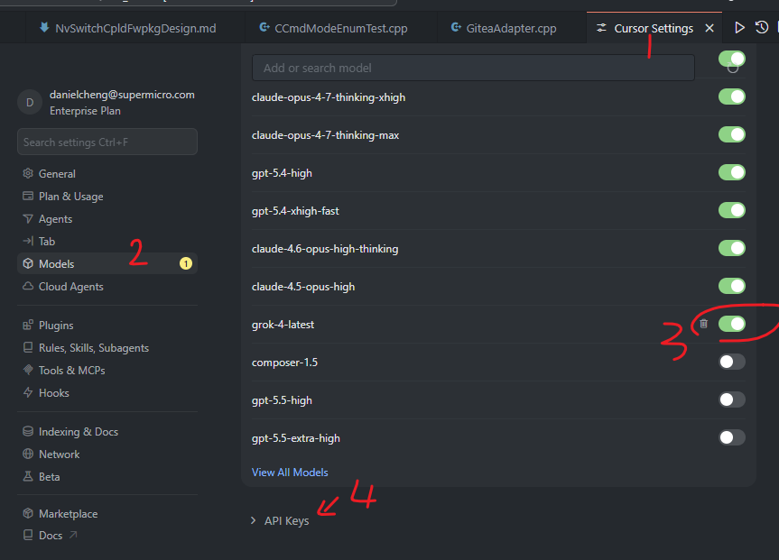
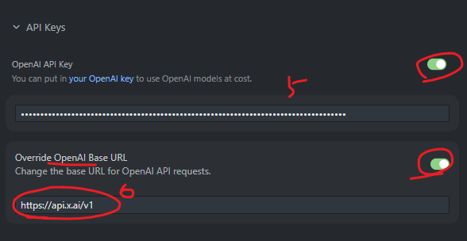

# Cursor + Grok API Key 設定指南

此資料夾收錄使用 **Cursor IDE** 搭配 **xAI Grok** 模型的設定教學與實際操作截圖。

## 目錄內容

- `cursor_pic1.png`：Cursor 設定 Grok API Key 與 Provider 的介面截圖
- `cursor_pic2.png`：Cursor 使用 Grok 模型進行程式碼生成與聊天的實際畫面
- `README.md`：本說明文件

## 快速設定步驟

1. 開啟 Cursor IDE
2. 按 `Ctrl + Shift + p` 開啟尋找視窗
3. 搜尋 "Cursor Setting"
4. 點擊"View All Models"
   - 選擇 `Grok` 系列模型
   - 填入您的 Grok API Key
5. 將 Grok 模型設為預設
6. 開始使用 `Cmd + L` 開啟聊天，或 `Cmd + K` 進行編輯

### 2. 實際使用畫面

**重點設定項目：**
- Base URL：`https://api.x.ai/v1`
- API Key：填入從 https://console.x.ai/ 取得的 `xai-...` 金鑰
- 預設模型建議使用 `grok-4.20-reasoning`

## 快速設定步驟

1. 開啟 Cursor IDE
2. 按 `Ctrl + Shift + p` 開啟尋找視窗
3. 搜尋 "Cursor Setting"
4. 點擊"View All Models"
   - 選擇 `Grok` 系列模型
   - 填入您的 Grok API Key
5. 將 Grok 模型設為預設
6. 開始使用 `Cmd + L` 開啟聊天，或 `Cmd + K` 進行編輯

## 注意事項

- 建議在 `.cursor/rules/` 中建立專案特定規則，提升 AI 輔助品質
- API Key 請妥善保管，勿上傳至公開儲存庫

---

**相關資料夾參考**：
- [`../hermes_w_grok_api_key/`](../hermes_w_grok_api_key/)：Hermes Agent 搭配 Grok 的設定文件

---

**Made by Hermes Agent (grok-4.20-reasoning)**  
**Reviewer: Derek Ko**
