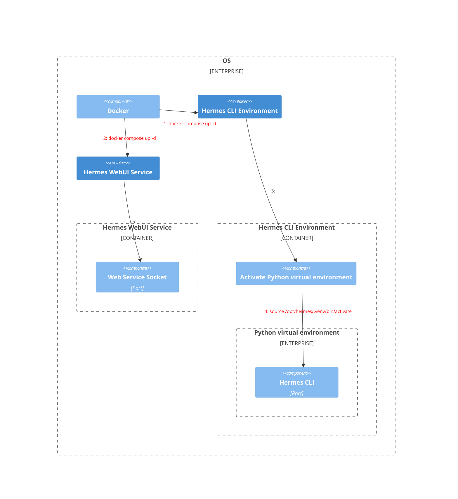

## Overview


 
```bash
### Docker
# Run docker compose in background
docker compose up -d
# Close compose
docker compose down
# Check docker compose status
docker compose ps
# Enter docker container
docker exec -it docker exec -it hermes-gateway bash
###

### Python env
# Activate python virtual environment
source /opt/hermes/.venv/bin/activate
# Deactivate environment
deactivate
###

### Hermes
# Hermes-CLI only be used in Python env
hermes
```

## 環境配置

| System | OS | Method | Hermes Version |
| ------ | -- | ------ | -------------- |
| MacBook Air M2 2022 | 15.7.4（24G517）| Docker | 0.13.0 |

## Setup Steps
### Discord
#### Setup Discord Bot
1. 登入[Discord 開發人員網站](https://discord.com/developers/home)，登入你的帳號
2. 點擊左側的應用程式(Application)，建立一個新的應用程式，取好名稱
3. 在左側選單進入 Bot 頁面，點擊 Reset Token 來取得並複製你的 Bot Token（妥善保存，會顯示一次）
4. 往下捲動找到 **Privileged Gateway Intents**，並開啟 Message Content Intent 以及 Server Members Intent，然後儲存
5. 在左側選單進入 OAuth2 使用 **OAuth2 URL 產生器**，勾選 bot 與 applications.commands
6. **機器人權限** 至少勾選**檢視頻道**、**傳送訊息**、**嵌入連結**、**附加檔案**、**讀取訊息歷史紀錄**
7. 複製**產生 URL**，貼在瀏覽器開啟並將 Bot 邀請至你的伺服器

#### Get Discord User ID
為了安全起見，Hermes 預設會封鎖所有人的請求，必須設定白名單：
1. 在 Discord 客戶端的設定中，左側欄位最下方開啟**開發者模式**
2. 在任意頻道或成員名單中右鍵點擊你的帳號，選擇**複製使用者 ID**

### Hermes-Agent
#### 1. Create directory for Hermes-Agent
```bash
mdkir -p ~/Hermes-Agent/.hermes
```

#### 2. Create Docker compose file
Create compose yaml file.  Command: `touch ~/Hermes-Agent/docker-compose.yml`.
Copy the content below to your file.

```yaml
services:
  gateway:
    build:
      context: .
      dockerfile: Dockerfile
    image: hermes-agent-local:latest
    container_name: hermes-gateway
    restart: unless-stopped
    volumes:
      - ~/Hermes-Agent:/opt/data
    ports:
      - "8642:8642"
    environment:
      - HERMES_UID=501
      - HERMES_GID=20

  dashboard:
    image: hermes-agent-local:latest
    container_name: hermes-dashboard
    restart: unless-stopped
    depends_on:
      - gateway
    volumes:
      - ~/Hermes-Agent:/opt/data
    ports:
      - "9119:9119"
```

#### 3. Create Dockerfile for extension packages
```dockerfile
FROM nousresearch/hermes-agent:latest

USER root

# Update system package list and install curl
RUN apt-get update && apt-get install -y curl && rm -rf /var/lib/apt/lists/*

# Install pip in virtual env
RUN curl -sS https://bootstrap.pypa.io/get-pip.py | /opt/hermes/.venv/bin/python

# Install playwright
RUN /opt/hermes/.venv/bin/pip install playwright

# Install Playwright dependancy packages automatically and install Chromium
RUN /opt/hermes/.venv/bin/playwright install --with-deps chromium

# run
CMD ["gateway", "run"]
```

#### 4. Configure Herems-Agent setting
執行 Docker compose 內容並設定 Hermes-Agent：
1. 選擇"建議設定"
2. 選擇"模型供應商"
3. 填寫你的 API KEY，模型供應商的 URL 不需要改動，除非使用地端模型
5. 選擇"模型"
6. 選擇"設定通訊平台"
7. 填寫通訊平台的數字並按下"Enter"，本次使用 Discord
8. 填寫"使用者ID"與填寫"頻道ID"

```bash
docker compose run --rm -it gateway setup                                   
```

### 常用設定
Hermes-Agent 的常用設定都會被保留在 `~/Hermes-Agent/.env` 內，以下是我的設定供參考：
> AGENT_BROWSER_EXECUTABLE_PATH 需要設定，下方的 [Problems 4: Agent 在容器內找不到瀏覽器工具](#problems)

```
GITHUB_ACCESS_TOKEN=xxxxxxx

# Git identity settings (for Hermes terminal tool)
GIT_AUTHOR_NAME=Derek KO
GIT_AUTHOR_EMAIL=kodaiyen@gmail.com

# 指定本地端 Chromium 瀏覽器路徑
AGENT_BROWSER_EXECUTABLE_PATH=/opt/data/home/.cache/ms-playwright/chromium-1217/chrome-linux/chrome
```

## Problems
### Problem 1: Discord Bot 沒上線
需要確認 Discord KEY 是否能夠通
> 如果遇到 Key 沒有寫錯，但還是沒看到 Bot 顯示上線，就把 Docker 容器重新啟動

### Problem 2: Discord Bot 無法被提及
需要在頻道內設定 bot 能夠被其他人提及

### Problem 3: Discord Bot 不會回覆你 (`@bot`)
#### 3.1 使用 Docker logs 確認 hermes-gateway 狀態
先使用私人訊息傳給 Hermes-Agent 確認 bot 會回覆，此步驟是確認 bot 允許回覆此 Discord ID。
```bash
ko@macbook-air:/Users/ko/Hermes-Agent$ docker logs hermes-gateway --tail 100                                                        
Changing hermes UID to 501
Changing hermes GID to 20
Fixing ownership of /opt/data to hermes (501)
Dropping root privileges
Syncing bundled skills into ~/.hermes/skills/ ...

Done: 0 new, 0 updated, 91 unchanged. 91 total bundled.
┌─────────────────────────────────────────────────────────┐
│           ⚕ Hermes Gateway Starting...                 │
├─────────────────────────────────────────────────────────┤
│  Messaging platforms + cron scheduler                    │
│  Press Ctrl+C to stop                                   │
└─────────────────────────────────────────────────────────┘

[Discord] Resolving 1 username(s): kodaiyen
[Discord] Resolved 'kodaiyen' -> 470609158450708490 (kodaiyen#0)
[Discord] Updated DISCORD_ALLOWED_USERS with 1 resolved ID(s)
WARNING gateway.run: Unauthorized user: 470609158450708490 (KO) on discord
WARNING gateway.run: Unauthorized user: 470609158450708490 (KO) on discord
```

發現直接傳送私人訊息給 Hermes 是合法，但在頻道內叫他做事會失敗

#### 3.2 確認 Hermes-Agent 內的 `DISCORD_ALLOWED_USERS` 設定
原本設定為 `kodaiyen` ，Hermes-Agent 需要使用純數字的 ID，改寫內容為純數字 ID。
> **Note:** 可以透過第一步驟看到的數字得知 ID

#### 3.3 重新確認
改寫完畢後，重新在頻道內提及 bot，確認 Docker LOG 內會回覆你。

### Problem 4: Agent 在容器內找不到瀏覽器工具
Docker compose 預設下載的映像檔案為官方提供，官方提供非常精簡的環境，瀏覽器工具並不會被包含在內，需要自行包入額外的套件。
> 有另一個解決方式：使用 Hermes 內提供的雲端私服器 API，讓 Agent 透過遠端的伺服器撈取瀏覽器的內容，本次不參考。

在上述步驟中安裝瀏覽器的套件，需要調整設定檔案才能讓套件成功被 Agent 使用。
此類型問題已經被提報給官方 GitHub:
* [[Bug]: _chromium_installed() ignores AGENT_BROWSER_EXECUTABLE_PATH and system Chrome — browser tools unnecessarily gated #19294](https://github.com/NousResearch/hermes-agent/issues/19294))
* [[Bug]: Auto-launch failed: Chrome not found error when running hermes-cli with official Docker image #15697](https://github.com/NousResearch/hermes-agent/issues/15697)

**Solution**
1. 進入 Hermes-Agent 容器
2. 先找尋額外安裝的套件在哪
3. 在設定檔案 `.env` 內重新宣告 Agent Browser 的路徑

```bash
# Enter docker container
docker exec -it hermes-gateway /bin/bash

# Check tool location
find / -type f \( -name "chrome" -o -name "chromium" -o -name "chromium-browser" \) -executable 2>/de
v/null

# Exit container and modify configuration
echo "" >> ~/Hermes-Agent/.env          
echo "# 指定本地端 Chromium 瀏覽器路徑" >> ~/Hermes-Agent/.env
echo "AGENT_BROWSER_EXECUTABLE_PATH=/opt/data/home/.cache/ms-playwright/chromium-1217/chrome-linux/chrome" >> ~/Hermes-Agent/.env
```


