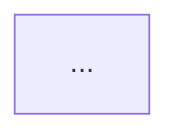

# Cursor plan.md 範本（繁體中文）

## 目標

讓 plan.md 維持一致格式（frontmatter + 固定段落 + 繁體中文），不用每次重想版型。

## 觸發情境

- 使用者在 Plan mode，或直接說「幫我寫個 plan.md」
- 「把這個重構想法整理成計畫」
- 「寫一份規劃文件，讓 Agent 之後照著做」

## Frontmatter 規格（YAML）

四個欄位，順序固定：

```yaml
---
name: <短名稱，英文或中英混合，≤ 40 字>
overview: <1–3 句話把「為什麼改、改什麼、怎麼驗」講完>
todos:
  - id: <kebab-case-id>
    content: <動詞開頭的一句話，描述這步要做什麼>
    status: pending | in_progress | completed
  - id: ...
isProject: false
---
```

### 各欄位細則

- **name**：動詞 + 名詞結構，不要加版本號。
- **overview**：寫給「未來的 Agent」看的一句話摘要。要含：**目的**、**改動範圍**、（若有）**關鍵決策**。避免空泛的「改善程式品質」。
- **todos**：只列**可執行**的步驟；`id` 用 kebab-case；`content` 動詞開頭。純說明型 plan：`todos: []`。
- **isProject**：預設 `false`。只有跨多次對話、長期追蹤的大專案才設 `true`。

## Body 結構（Markdown）

按這個順序寫，缺某節可省略，但**不要加新節**（保持一致性）：

```markdown
# <中文標題>

## 目標 / 最終方向
<一段文字，總結 why 與策略，不談實作細節>

## 現況釐清（若有）
<描述改動前的狀態、常見誤解、模組邊界>

## 會怎麼改
### 1. <子主題>
<檔案清單 + 具體改法>

### 2. <子主題>
...

## 模組邊界 / 架構變化（若有）


## 不做的事 / 紅線
- <明確列出不會順手改的地方、不引入的抽象>

## 驗證方式 / 測試步驟
- <編譯、行為、錯誤路徑驗證>

## 結論（若有）
<1–2 段總結；可條列要點>
```

## 寫作偏好

- **一律繁體中文**
- **檔案路徑用 markdown link**：`[Foo.cpp](src/module/Foo.cpp)`，在 Cursor 裡可點擊跳轉
- **inline code 用反引號**：class / function / option 名
- **比較 / 對照用 markdown 表格**
- **mermaid 圖只畫「模組關係」或「前後對照」**，不畫無資訊量的時序圖
- **短句優先**，條列時用 `-` 不用 `*`

## 紅線（plan 不該做的）

- **不**把實作 code 大段貼進 plan
- **不**預先寫完整測試程式碼（只描述測試步驟）
- **不**列 commit message
- **不**列無 action 的「討論事項」
- **不**加進度百分比或 estimated time
- **不**包含不確定猜測；有歧義就列「待使用者決定」

## 用詞偏好（動詞）

| 優先 | 避免 | 場景 |
|---|---|---|
| 搬、搬到 | 遷移 | 把程式從 A 檔搬到 B 檔 |
| 集中、統一 | 歸納 | 多處邏輯收到一處 |
| 清理、整理 | 清潔 | 拿掉冗餘 |
| 內聯 | 合併 | 把 wrapper 收回呼叫點 |
| 釐清 | 澄清 | 解釋現況與誤解 |

### 中英混雜規則

- **技術名詞保持英文**：class / function / enum 名稱不翻譯
- **動詞與連接詞用中文**
- **反引號包住英文識別碼**

## 輸出 checklist

- [ ] Frontmatter 四個欄位都有，順序正確
- [ ] `overview` 一句話能讓新 Agent 知道要做什麼
- [ ] `todos` 每項都是可執行動作（或 `todos: []`）
- [ ] 檔案路徑都用 markdown link
- [ ] 有「不做的事」一節
- [ ] 有「驗證方式」一節
- [ ] 全文繁體中文
